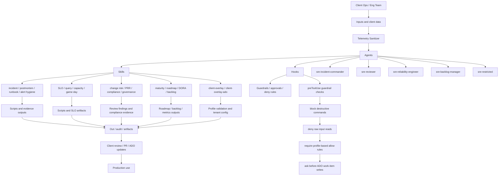

# Roadmap: agentic, ML and advanced capabilities

Twelve items in three horizons. Each builds on data the kit already produces, so check readiness first:
`python .github/skills/sre-roadmap-readiness/scripts/readiness.py out/readiness/readiness.yaml`.

Status: **built** (active skill or script), **preview** (built, not yet validated on a client),
**draft** (design in `roadmap/`, not loaded by Copilot).

| ID | Horizon | Item | Status | Kit artifact | Extends | Owner |
| --- | --- | --- | --- | --- | --- | --- |
| R1 | 1 | Kit as Azure SRE Agent plugins | draft | `roadmap/R1-sre-agent-plugins.md` | whole kit | Kit champions |
| R2 | 1 | Multi-agent incident response | draft | `roadmap/skills/sre-incident-swarm` | sre-incident-command | Kit champions |
| R3 | 1 | Closed-loop remediation (autonomy ladder) | draft | `roadmap/skills/sre-autonomy-ladder` | sre-runbook-author, guardrail hook | Practice lead + client ops |
| R4 | 1 | Continuous reliability agents | draft | `roadmap/skills/sre-continuous-agents` | reliability gates pipeline, all scripts | Kit champions |
| R5 | 2 | Change risk prediction | draft | `roadmap/skills/sre-change-risk-model` | sre-ado-delivery-metrics, sre-change-risk-review | Data/ML lead |
| R6 | 2 | Anomaly detection and dynamic baselines | draft | `roadmap/skills/sre-anomaly-baselines` | sre-alert-hygiene, sre-capacity-forecast | Data/ML lead |
| R7 | 2 | Incident similarity search | draft | `roadmap/skills/sre-incident-similarity` | sre-postmortem-author | Data/ML lead |
| R8 | 2 | Alert correlation | draft | `roadmap/skills/sre-alert-correlation` | sre-alert-hygiene | Kit champions |
| R9 | 2 | Error budget forecasting | preview | `sre-slo-designer/scripts/budget_forecast.py` | sre-slo-designer | Kit champions |
| R10 | 3 | Service dependency twin | draft | `roadmap/skills/sre-dependency-twin` | sre-gameday-planner | Data/ML lead |
| R11 | 3 | SRE for AI agents | draft | `roadmap/skills/sre-agent-reliability` | new practice offering | Practice lead |
| R12 | 3 | AI governance evidence | draft | `roadmap/skills/sre-ai-governance-evidence` | sre-compliance-evidence | Compliance lead |
| — | all | Roadmap readiness | built | `.github/skills/sre-roadmap-readiness` | all | Kit champions |

## Design constraints for every item

- **Data stays in-boundary.** Restricted clients need models trained and hosted in their environment; prefer small per-client models.
- **Cross-client learning needs consent.** Anonymized benchmarks require explicit contractual consent and aggregation only.
- **Autonomy is earned.** Every autonomous action keeps deterministic hook enforcement and a recorded rollback path.
- **Data quality first.** ML depends on incident attribution and postmortem quality, so Horizon 1 feeds Horizon 2.

See `roadmap/README.md` for how a draft becomes an active skill.

## Repo map

## Workflow-by-use-case matrix

| Scenario | Trigger | Primary agents | Primary skills | Guardrail / policy | Output |
| --- | --- | --- | --- | --- | --- |
| Incident | outage, degradation, bridge notes, log exports | sre-incident-commander | sre-telemetry-sanitizer, sre-incident-command, sre-postmortem-author | sanitize before analysis; block raw reads; deny unsafe writes | timeline, severity, status update, postmortem draft |
| Launch / go-live | production readiness or cutover | sre-reviewer, sre-reliability-engineer | sre-production-readiness, sre-ado-pipeline-reliability, sre-change-risk-review, client-overlay | validate profile and approvals; deny destructive commands | readiness result, risk findings, launch recommendation |
| Audit / compliance | control review, SOC2 / NIST / ISO evidence request | sre-reviewer | sre-compliance-evidence, sre-ado-org-governance, sre-ado-pipeline-reliability | read-only review posture; no unapproved configuration change | control mapping, gap list, evidence inventory |
| Roadmap / maturity | current-state review, next-capability planning | sre-reviewer, sre-backlog-manager | sre-maturity-assessment, sre-roadmap-readiness, sre-ado-delivery-metrics, sre-ado-reliability-backlog | preview before ADO updates; restrict writes to approved path | maturity score, roadmap readiness, backlog action plan |

## How the repo fits together

- Agents define the operating role.
- Skills define the domain capability.
- Hooks enforce safety and policy boundaries.
- Scripts convert guidance into measurable evidence.
- Overlay configuration shapes the operating profile for the client.

This is the practical operating model for the kit: safe execution, evidence-first evaluation, and structured progress from triage to readiness and roadmap prioritization.
